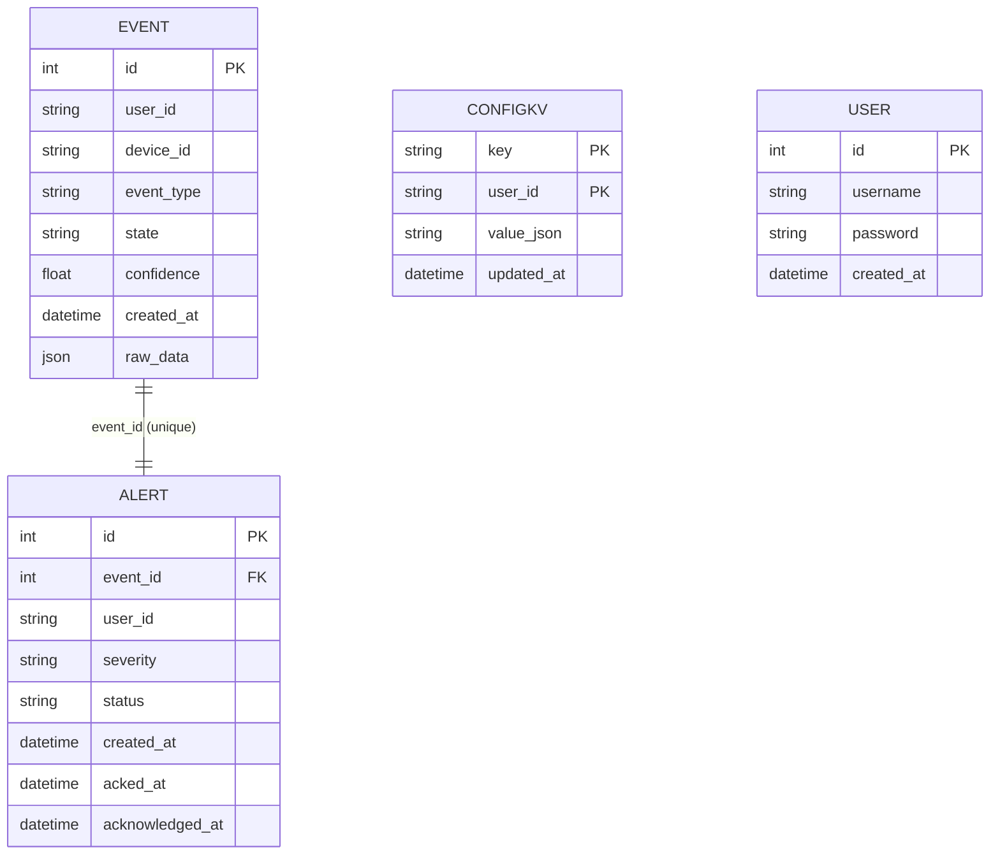

# Data model

## Event
Fields
- id
- user_id
- device_id
- event_type
- state
- confidence
- created_at
- raw_data

Indexes/constraints
- id: primary key
- user_id: index
- device_id: index
- event_type: index
- state: index

Relationships
- Alert 1:1 via Alert.event_id (back_populates=event)

## Alert
Fields
- id
- event_id
- user_id
- severity
- status
- created_at
- acked_at
- acknowledged_at

Indexes/constraints
- id: primary key
- event_id: unique, foreign key -> Event.id
- user_id: index
- status: index

Relationships
- Event 1:1 via event_id (unique)

## ConfigKV
Fields
- key
- user_id
- value_json
- updated_at

Indexes/constraints
- (key, user_id): composite primary key

Relationships
- none

## User
Fields
- id
- username
- password
- created_at

Indexes/constraints
- id: primary key
- username: unique, index

Relationships
- none

## Mermaid ERD

