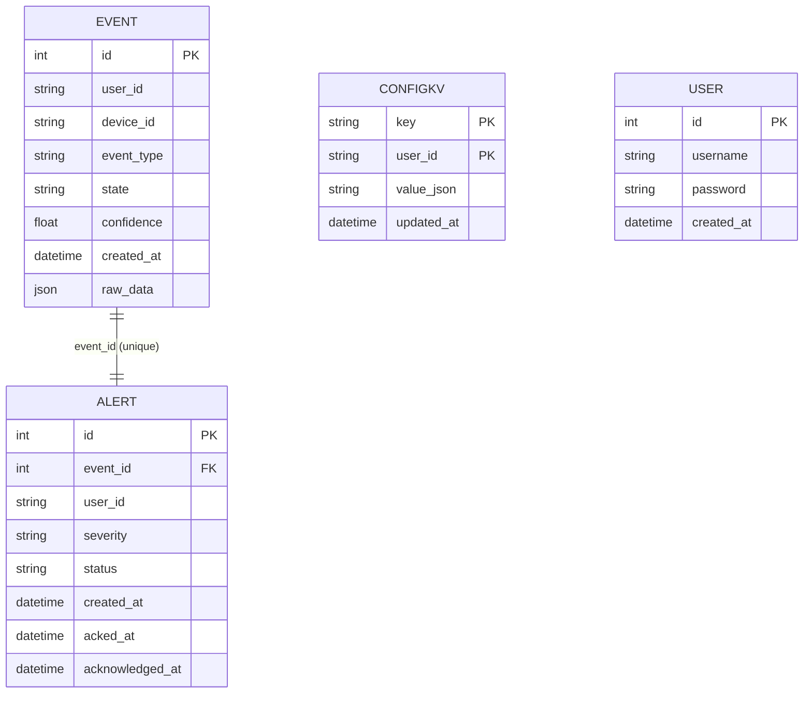
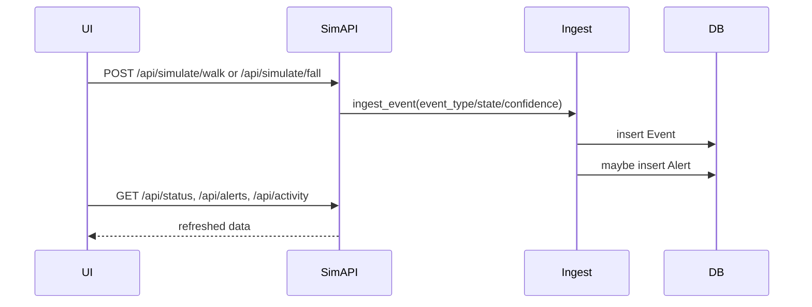

# Presentation

## Slide 1 — Architecture
- FastAPI app serves HTML pages + JSON APIs.
- Routers in [app/api](app/api); auth enforced via JWT dependency.
- Services handle ingestion, alerting, simulator, config.
- SQLite persistence via SQLAlchemy models in [app/db](app/db).

## Slide 2 — Data Model
- Event 1:1 Alert (unique `event_id`).
- ConfigKV stores per-user JSON config.
- User holds login credentials.



## Slide 3 — Workflow
- Startup schedules simulator loop.
- Loop pauses on any ACTIVE + HIGH alert.
- Otherwise generates event and ingests (Event write + optional Alert).

```mermaid
flowchart TD
  A[startup()] --> B[init_db()]
  B --> C[asyncio.create_task(simulator_loop())]
  C --> D{ACTIVE + HIGH alert?}
  D -- Yes --> E[sleep + continue]
  D -- No --> F[get_config()]
  F --> G[next_activity_event()]
  G --> H[ingest_event()]
  H --> D
```

## Slide 4 — Demo Script
- Open /login → register or login.
- Redirect to / → observe status/alerts/activity panels.
- Click Alerts page → acknowledge/resolve an alert.
- Click Activity page → verify live updates.
- Click Config page → adjust thresholds and save.
- Use simulate buttons on home (walk/fall) to trigger updates.


