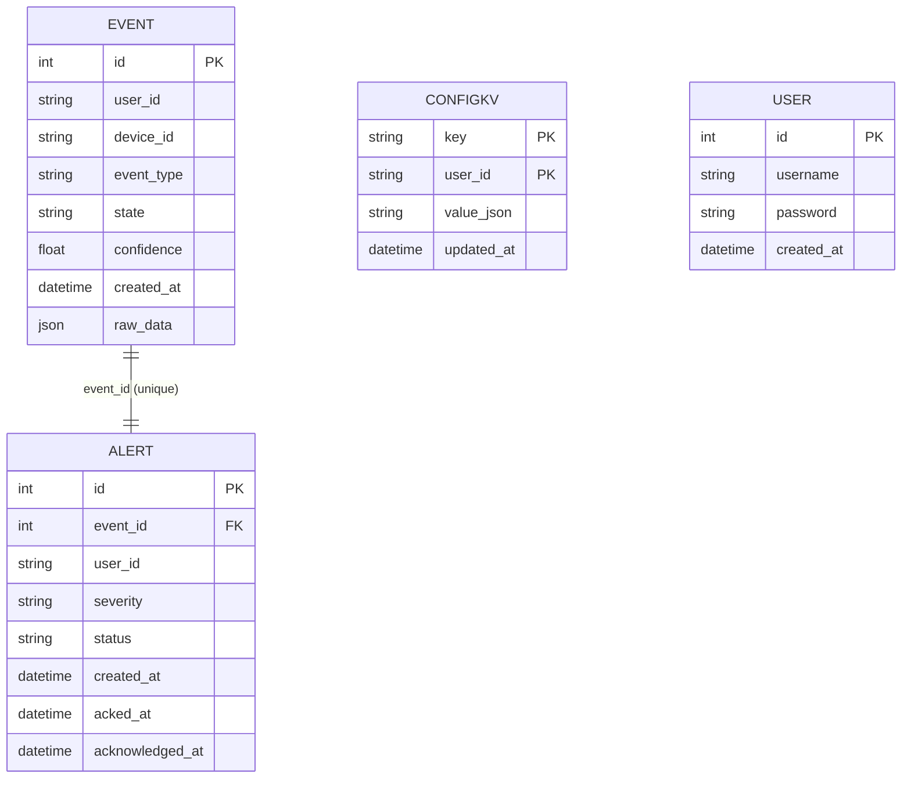
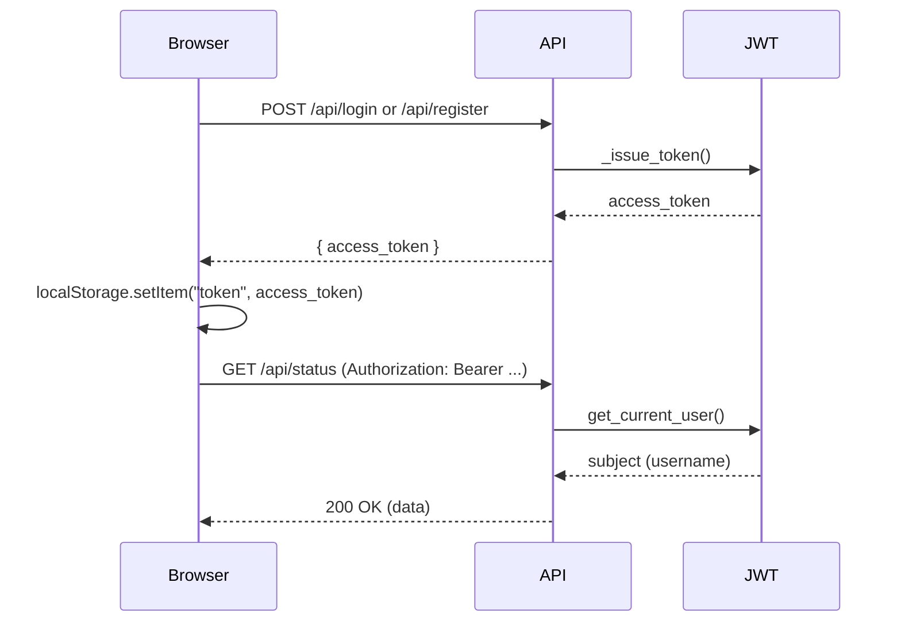
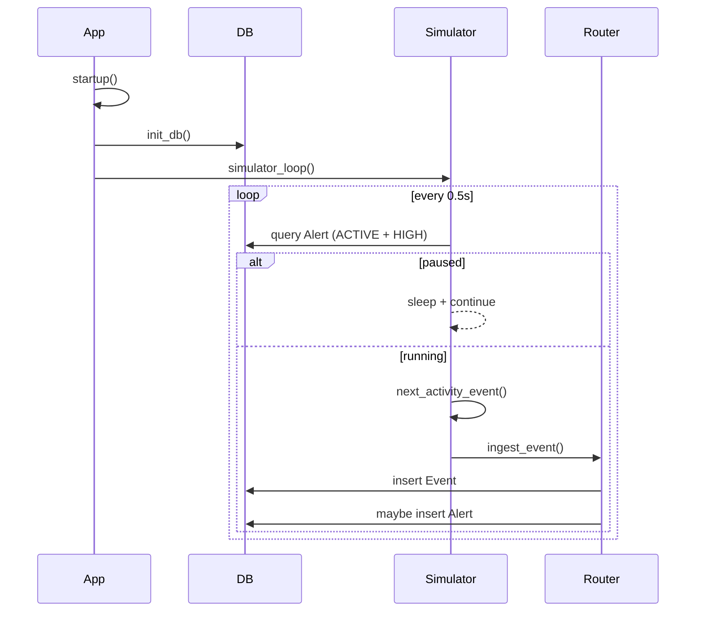
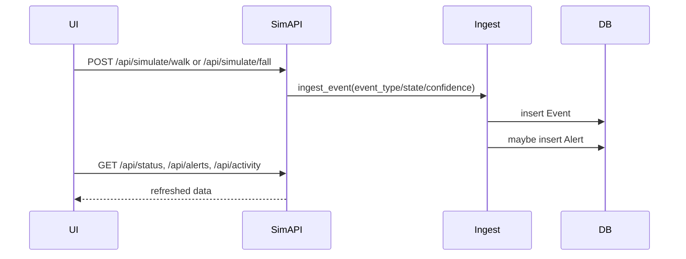
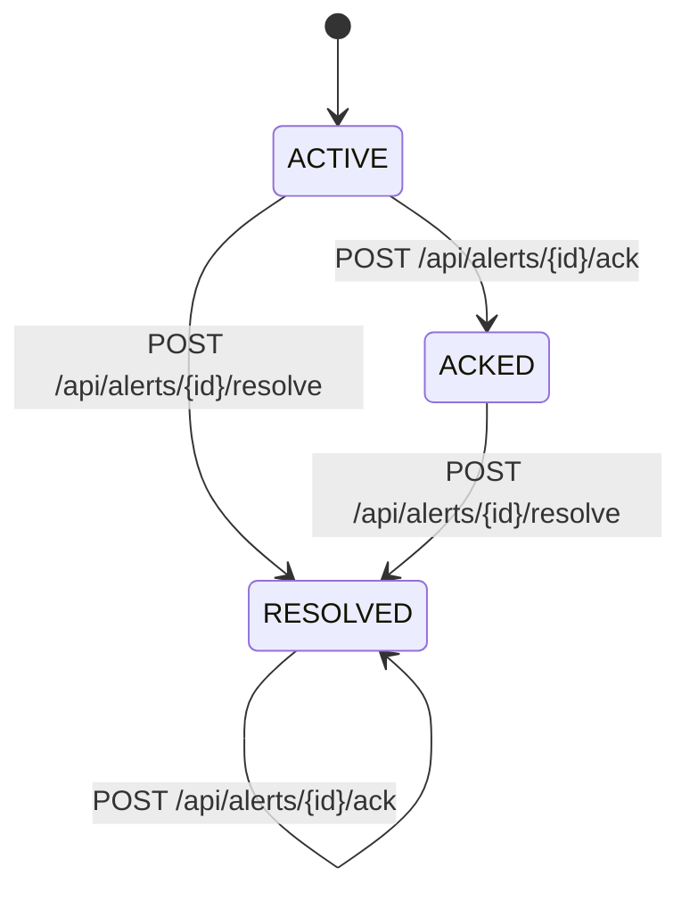

# Project Book (Draft)

## System Overview
1. Register or login via [static/login.js](static/login.js) -> `/api/register` or `/api/login` in [app/api/auth.py](app/api/auth.py).
2. API returns `{ access_token, token_type }` from `_issue_token()` in [app/api/auth.py](app/api/auth.py).
3. Frontend stores `access_token` in `localStorage` in [static/login.js](static/login.js).
4. Frontend attaches `Authorization: Bearer <token>` in `authFetch()` in [static/app.js](static/app.js), [static/status-page.js](static/status-page.js), [static/alerts-page.js](static/alerts-page.js), [static/activity-page.js](static/activity-page.js), [static/config-page.js](static/config-page.js).
5. Backend enforces JWT via `get_current_user()` dependency in [app/api/auth.py](app/api/auth.py); routers are wired with this dependency in [app/main.py](app/main.py).
6. If API responds 401, frontend clears token and redirects to `/login` in `authFetch()` across the same files.

## Architecture
1. App startup registers `startup()` in [app/main.py](app/main.py), which calls `init_db()` and schedules `simulator_loop()`.
2. `simulator_loop()` runs continuously and opens a DB session via `SessionLocal` in [app/main.py](app/main.py).
3. Pause rule: if any `Alert` exists with `status == "ACTIVE"` and `severity == "HIGH"`, the loop sleeps and continues without generating events (query in `simulator_loop()` in [app/main.py](app/main.py)).
4. When not paused, config is loaded with `get_config()` and a synthetic event is generated with `next_activity_event()` in [app/services/simulator.py](app/services/simulator.py).
5. The event is ingested via `ingest_event()` in [app/services/event_router.py](app/services/event_router.py), which writes `Event` and optionally creates `Alert`.

## Data Model

### Event
Fields
- id
- user_id
- device_id
- event_type
- state
- confidence
- created_at
- raw_data

Indexes/constraints
- id: primary key
- user_id: index
- device_id: index
- event_type: index
- state: index

Relationships
- Alert 1:1 via Alert.event_id (back_populates=event)

### Alert
Fields
- id
- event_id
- user_id
- severity
- status
- created_at
- acked_at
- acknowledged_at

Indexes/constraints
- id: primary key
- event_id: unique, foreign key -> Event.id
- user_id: index
- status: index

Relationships
- Event 1:1 via event_id (unique)

### ConfigKV
Fields
- key
- user_id
- value_json
- updated_at

Indexes/constraints
- (key, user_id): composite primary key

Relationships
- none

### User
Fields
- id
- username
- password
- created_at

Indexes/constraints
- id: primary key
- username: unique, index

Relationships
- none

## Mermaid ERD



## API Summary

### auth

| Endpoint | Method | Auth? | Purpose | Request | Response | Implemented in (path) |
| --- | --- | --- | --- | --- | --- | --- |
| /api/login | POST | No | Issue JWT token for login | JSON: { username, password } | JSON: { access_token, token_type } | [app/api/auth.py](app/api/auth.py) |
| /api/register | POST | No | Register user and issue JWT | JSON: { username, password } | JSON: { access_token, token_type } | [app/api/auth.py](app/api/auth.py) |

### simulate

| Endpoint | Method | Auth? | Purpose | Request | Response | Implemented in (path) |
| --- | --- | --- | --- | --- | --- | --- |
| /api/simulate/walk | POST | Yes | Inject walking event | none | JSON: ingest_event result | [app/api/simulate.py](app/api/simulate.py) |
| /api/simulate/fall | POST | Yes | Inject fall event | none | JSON: ingest_event result | [app/api/simulate.py](app/api/simulate.py) |

### alerts

| Endpoint | Method | Auth? | Purpose | Request | Response | Implemented in (path) |
| --- | --- | --- | --- | --- | --- | --- |
| /api/alerts | GET | Yes | List active alerts + last resolved | query: limit | JSON: list[Alert] | [app/api/alerts.py](app/api/alerts.py) |
| /api/alerts/{alert_id}/ack | POST | Yes | Acknowledge alert | path: alert_id | JSON: { status, id } | [app/api/alerts.py](app/api/alerts.py) |
| /api/alerts/{alert_id}/resolve | POST | Yes | Resolve alert | path: alert_id | JSON: { status, id } | [app/api/alerts.py](app/api/alerts.py) |

### activity

| Endpoint | Method | Auth? | Purpose | Request | Response | Implemented in (path) |
| --- | --- | --- | --- | --- | --- | --- |
| /api/activity | GET | Yes | Recent activity events | query: limit | JSON: list[{ id, timestamp, event_type, confidence, state, raw_data }] | [app/api/activity.py](app/api/activity.py) |

### status

| Endpoint | Method | Auth? | Purpose | Request | Response | Implemented in (path) |
| --- | --- | --- | --- | --- | --- | --- |
| /api/status | GET | Yes | Latest system status | none | JSON: { state, active_alert, system_paused, confidence, last_update } | [app/api/status.py](app/api/status.py) |

### config

| Endpoint | Method | Auth? | Purpose | Request | Response | Implemented in (path) |
| --- | --- | --- | --- | --- | --- | --- |
| /api/config | GET | Yes | Read user config | none | JSON: config dict | [app/api/config.py](app/api/config.py) |
| /api/config | PUT | Yes | Update user config | JSON: { alert_confidence_threshold?, high_severity_threshold?, fall_probability?, device_id? } | JSON: config dict | [app/api/config.py](app/api/config.py) |

### logs

| Endpoint | Method | Auth? | Purpose | Request | Response | Implemented in (path) |
| --- | --- | --- | --- | --- | --- | --- |
| /api/logs/export | GET | Yes | Export recent events CSV | query: limit | text/csv (lifebridge_logs.csv) | [app/api/logs.py](app/api/logs.py) |

### events

| Endpoint | Method | Auth? | Purpose | Request | Response | Implemented in (path) |
| --- | --- | --- | --- | --- | --- | --- |
| /api/events | POST | Yes | Ingest event from device/app | JSON: { device_id, event_type, state, confidence } | JSON: { status, data } | [app/api/events.py](app/api/events.py) |

## Workflows

### Auth (JWT)

1. Register or login via [static/login.js](static/login.js) -> `/api/register` or `/api/login` in [app/api/auth.py](app/api/auth.py).
2. API returns `{ access_token, token_type }` from `_issue_token()` in [app/api/auth.py](app/api/auth.py).
3. Frontend stores `access_token` in `localStorage` in [static/login.js](static/login.js).
4. Frontend attaches `Authorization: Bearer <token>` in `authFetch()` in [static/app.js](static/app.js), [static/status-page.js](static/status-page.js), [static/alerts-page.js](static/alerts-page.js), [static/activity-page.js](static/activity-page.js), [static/config-page.js](static/config-page.js).
5. Backend enforces JWT via `get_current_user()` dependency in [app/api/auth.py](app/api/auth.py); routers are wired with this dependency in [app/main.py](app/main.py).
6. If API responds 401, frontend clears token and redirects to `/login` in `authFetch()` across the same files.



### Simulator loop + pause rule

1. App startup registers `startup()` in [app/main.py](app/main.py), which calls `init_db()` and schedules `simulator_loop()`.
2. `simulator_loop()` runs continuously and opens a DB session via `SessionLocal` in [app/main.py](app/main.py).
3. Pause rule: if any `Alert` exists with `status == "ACTIVE"` and `severity == "HIGH"`, the loop sleeps and continues without generating events (query in `simulator_loop()` in [app/main.py](app/main.py)).
4. When not paused, config is loaded with `get_config()` and a synthetic event is generated with `next_activity_event()` in [app/services/simulator.py](app/services/simulator.py).
5. The event is ingested via `ingest_event()` in [app/services/event_router.py](app/services/event_router.py), which writes `Event` and optionally creates `Alert`.

```mermaid
flowchart TD
  A[startup()] --> B[init_db()]
  B --> C[asyncio.create_task(simulator_loop())]
  C --> D{ACTIVE + HIGH alert?}
  D -- Yes --> E[sleep + continue]
  D -- No --> F[get_config()]
  F --> G[next_activity_event()]
  G --> H[ingest_event()]
  H --> D
```



### Manual simulate walk/fall

## Endpoints
- POST `/api/simulate/walk` in [app/api/simulate.py](app/api/simulate.py)
  - Calls `ingest_event()` in [app/services/event_router.py](app/services/event_router.py)
  - Payload values: `event_type="WALKING"`, `state="normal"`, `confidence=random.uniform(0.3, 0.6)`
- POST `/api/simulate/fall` in [app/api/simulate.py](app/api/simulate.py)
  - Calls `ingest_event()` in [app/services/event_router.py](app/services/event_router.py)
  - Payload values: `event_type="FALL_CONFIRMED"`, `state="danger"`, `confidence=0.96`

## Single ingestion path
Both endpoints use the same ingestion path through `ingest_event()` (Event write + optional Alert creation).



### Alert lifecycle

## States (as implemented)
- ACTIVE -> ACKED: POST `/api/alerts/{id}/ack` in [app/api/alerts.py](app/api/alerts.py)
  - Updates `Alert.status = "ACKED"`
  - Updates `Alert.acked_at = func.now()`
- ACTIVE/ACKED -> RESOLVED: POST `/api/alerts/{id}/resolve` in [app/api/alerts.py](app/api/alerts.py)
  - Updates `Alert.status = "RESOLVED"`
  - No timestamp fields updated
- If the alert is already RESOLVED, `/ack` returns `{ status: "resolved", id }` without changes.

## Fields updated
- `status` (ACTIVE/ACKED/RESOLVED)
- `acked_at` (set on ACK)
- `acknowledged_at` (unused in current implementation)



## UI ↔ API Mapping

## /status
- Page: [templates/status.html](templates/status.html)
- JS: [static/status-page.js](static/status-page.js)
- APIs: GET `/api/status` via `authFetch()`
- Polling: `setInterval(refreshStatus, 5000)`
- Render: `renderStatus()` updates badge/state/last update/confidence/paused

## /alerts
- Page: [templates/alerts.html](templates/alerts.html)
- JS: [static/alerts-page.js](static/alerts-page.js)
- APIs: GET `/api/alerts?limit=20`, POST `/api/alerts/{id}/ack`, POST `/api/alerts/{id}/resolve`
- Polling: `setInterval(refreshAlerts, 5000)`
- Render: `renderAlerts()` builds alert cards + action buttons

## /activity
- Page: [templates/activity.html](templates/activity.html)
- JS: [static/activity-page.js](static/activity-page.js)
- APIs: GET `/api/activity?limit=30`
- Polling: `setInterval(refreshActivity, 5000)`
- Render: `renderActivity()` fills table + activity strip dots

## /config
- Page: [templates/config.html](templates/config.html)
- JS: [static/config-page.js](static/config-page.js)
- APIs: GET `/api/config`, PUT `/api/config`
- Polling: none (loads once on page load)
- Render: `loadConfig()` populates form fields; `saveConfig()` posts updates

## /login
- Page: [templates/login.html](templates/login.html)
- JS: [static/login.js](static/login.js)
- APIs: POST `/api/login`, POST `/api/register`
- Polling: none
- Render: form submit handlers update status text and redirect

## Limitations + Next Steps
