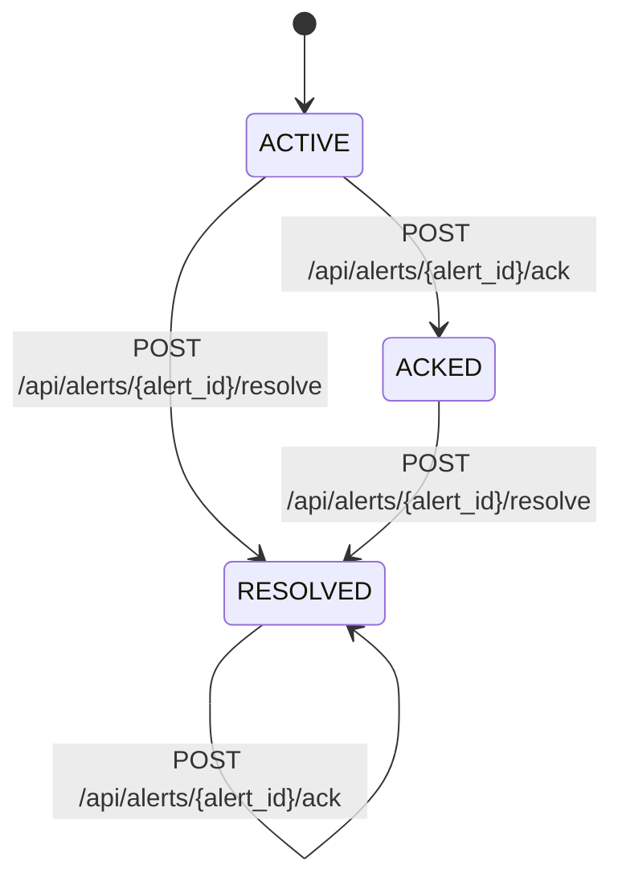

# Alert lifecycle workflow

## States (as implemented)
- ACTIVE -> ACKED: POST `/api/alerts/{alert_id}/ack` in [app/api/alerts.py](app/api/alerts.py)
  - Updates `Alert.status = "ACKED"`
  - Updates `Alert.acked_at = func.now()`
- ACTIVE/ACKED -> RESOLVED: POST `/api/alerts/{alert_id}/resolve` in [app/api/alerts.py](app/api/alerts.py)
  - Updates `Alert.status = "RESOLVED"`
  - No timestamp fields updated
- If the alert is already RESOLVED, `/ack` returns `{ status: "resolved", id }` without changes.

## Fields updated
- `status` (ACTIVE/ACKED/RESOLVED)
- `acked_at` (set on ACK)
- `acknowledged_at` (unused in current implementation)

## Mermaid state diagram

