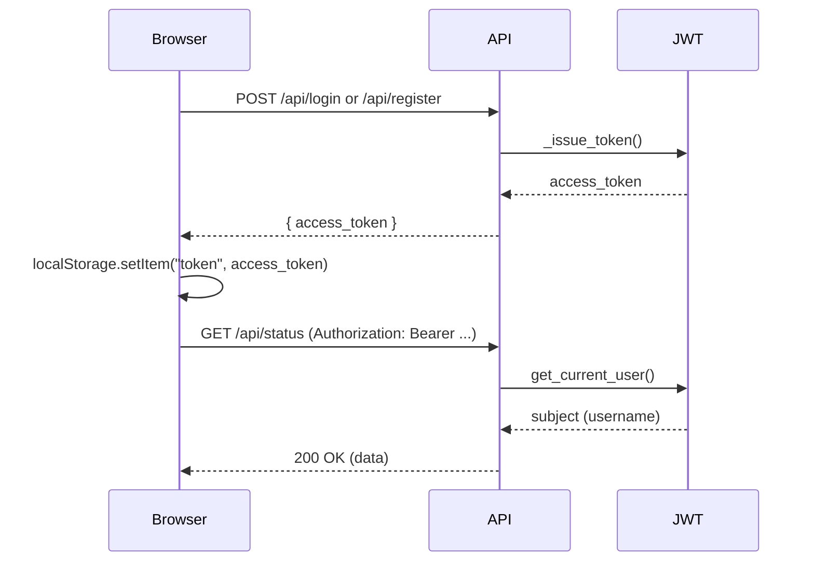

# Auth workflow (JWT)

## Steps
1. Register or login via [static/login.js](static/login.js) -> `/api/register` or `/api/login` in [app/api/auth.py](app/api/auth.py).
2. API returns `{ access_token, token_type }` from `_issue_token()` in [app/api/auth.py](app/api/auth.py).
3. Frontend stores `access_token` in `localStorage` in [static/login.js](static/login.js).
4. Frontend attaches `Authorization: Bearer <token>` in `authFetch()` in [static/app.js](static/app.js), [static/status-page.js](static/status-page.js), [static/alerts-page.js](static/alerts-page.js), [static/activity-page.js](static/activity-page.js), [static/config-page.js](static/config-page.js).
5. Backend enforces JWT via `get_current_user()` dependency in [app/api/auth.py](app/api/auth.py); routers are wired with this dependency in [app/main.py](app/main.py).
6. If API responds 401, frontend clears token and redirects to `/login` in `authFetch()` across the same files.

## Mermaid sequence

