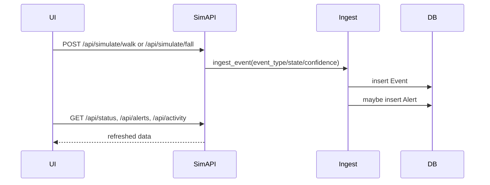

# Manual simulate walk/fall workflow

## Endpoints
- POST `/api/simulate/walk` in [app/api/simulate.py](app/api/simulate.py)
  - Calls `ingest_event()` in [app/services/event_router.py](app/services/event_router.py)
  - Payload values: `event_type="WALKING"`, `state="normal"`, `confidence=random.uniform(0.3, 0.6)`
- POST `/api/simulate/fall` in [app/api/simulate.py](app/api/simulate.py)
  - Calls `ingest_event()` in [app/services/event_router.py](app/services/event_router.py)
  - Payload values: `event_type="FALL_CONFIRMED"`, `state="danger"`, `confidence=0.96`

## Single ingestion path
Both endpoints use the same ingestion path through `ingest_event()` (Event write + optional Alert creation).

## Mermaid sequence

