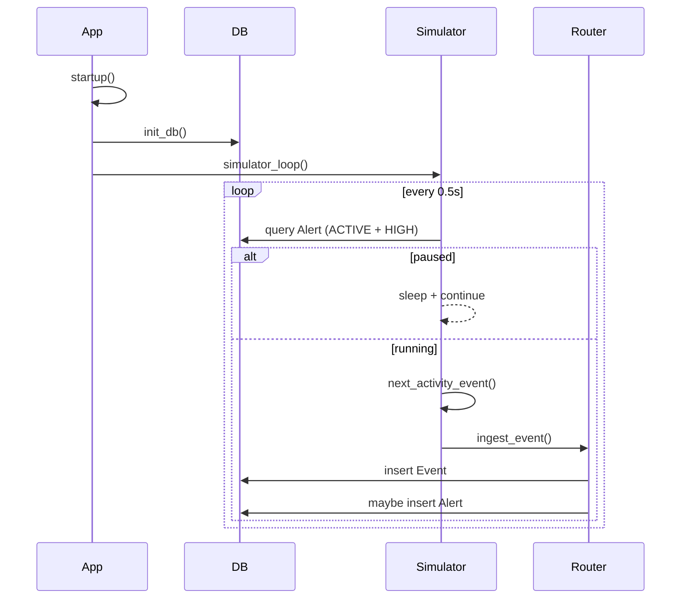

# Simulator loop workflow

## Steps
1. App startup registers `startup()` in [app/main.py](app/main.py), which calls `init_db()` and schedules `simulator_loop()`.
2. `simulator_loop()` runs continuously and opens a DB session via `SessionLocal` in [app/main.py](app/main.py).
3. Pause rule: if any `Alert` exists with `status == "ACTIVE"` and `severity == "HIGH"`, the loop sleeps and continues without generating events (query in `simulator_loop()` in [app/main.py](app/main.py)).
4. When not paused, config is loaded with `get_config()` and a synthetic event is generated with `next_activity_event()` in [app/services/simulator.py](app/services/simulator.py).
5. The event is ingested via `ingest_event()` in [app/services/event_router.py](app/services/event_router.py), which writes `Event` and optionally creates `Alert`.

## Mermaid flow

```mermaid
flowchart TD
  A[startup()] --> B[init_db()]
  B --> C[asyncio.create_task(simulator_loop())]
  C --> D{ACTIVE + HIGH alert?}
  D -- Yes --> E[sleep + continue]
  D -- No --> F[get_config()]
  F --> G[next_activity_event()]
  G --> H[ingest_event()]
  H --> D
```

## Mermaid sequence


